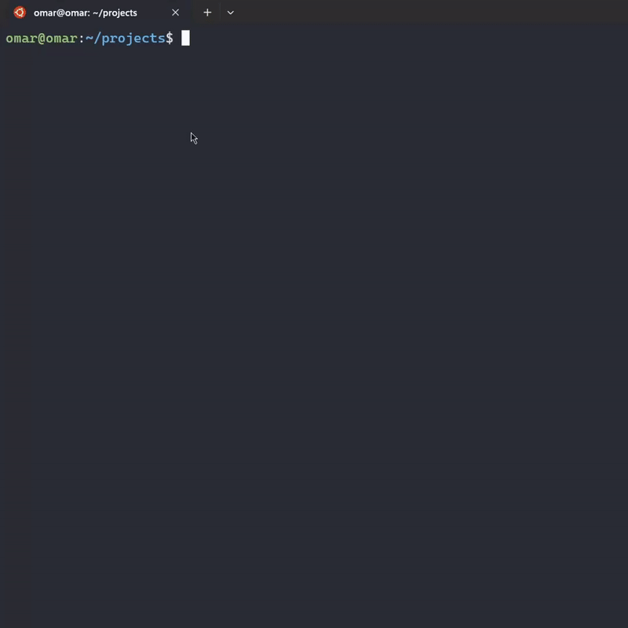

# express-tool

**NOTE:** `et` abbreviation to `express-tool`

You can run the command in `et` to be simple. 😊

## installation

```sh
npm install -g express-tool
```

## Quick start

go to the directory you need to generate the project and execute this command

```bash
new|n [options] [project-name]
```

**NOTE:** You can only use new commands, and he gives you some questions.



## Command Line Options
This generator can also be further configured with the following command line flags.

## new | n

-     -p, --package <type> to choose package manager you use
-     -js, --javascript  to create a project using JavaScript
-     -ts, --typescript  to create a project using TypeScript
-     -mjs, --ECMAScript to create project in JavaScript with ECMAScript Modules (JavaScript only)

## License

[MIT](LICENSE.txt)
